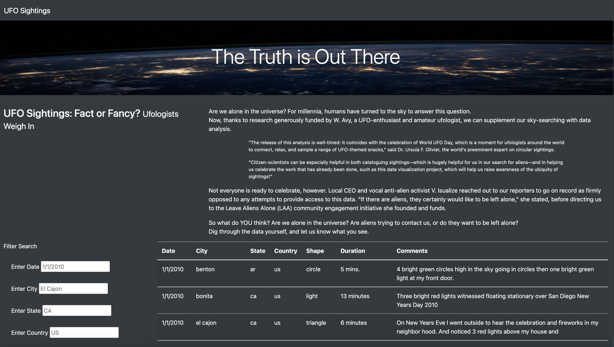
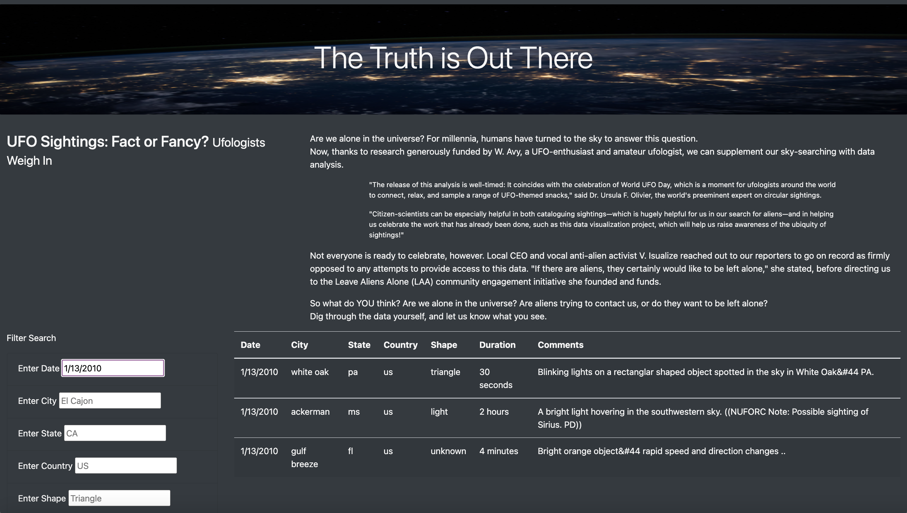
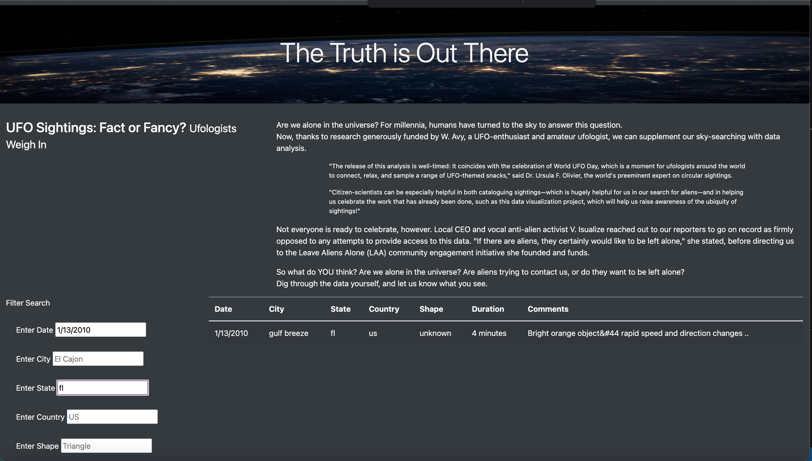

# UFOs

## Purpose 

The purpose of this project is to create a webpage containing a dynamic table to provide a more in-depth analysis of UFO sightings by allowing users to filter (at the same time) multiple criteria including date, city, state, country, and shape.

## Results

- When one reaches the webpage, users will notice a table full of data. Although the data table is not large, the left side of the webpage gives users the ability to filter data using multiple criteria to narrow down the search. 

- In this image, we first filtered data based on a specific date: 1/13/2010. As a result, there were only 3 UFO's sightings.

- In this image, we can see that another filter has been applied under the State criteria. This demonstrates that multiple filters can be applied to narrow down the results.

## Summary

- One drawback of this design is that data points are case sensitive. This means that if a user wants to find sightings that occurred in Florida, one would have to type "fl". The following inputs will not yield any results: "florida", "FL", "Fl", "Florida".

### Recommendations
- I would recommend adding a drop down of all available data points so that users can select and find what one is looking for.
- Including coordinates data can also help a user search for sightings near an area rather than searching by specific city/state.
- The final feature I would include is a view on all the filters that have been applied and the ability to add and remove filters as desired.

